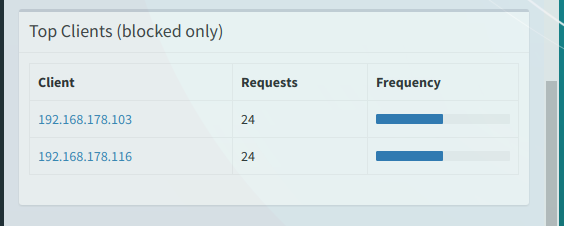

# PiHole on kubernetes

A sample deployment for pihole on a kubernetes cluster. I'm running an on premise kubernetes cluster and i'm using MetaLB 0.7.3 for loadbalancing and rook for storage.

## Installation:
* First setup the service to get an ip for your installation. The services in this sample are configured to share the same ip address.

  ```
  $ kubectl apply -f svc-pihole-tcp.yml
  $ kubectl apply -f svc-pihole-udp.yml
  ```

  after the service has been created, both should listen to the same EXTERNAL-IP.

  ```
  $ kubectl get svc pihole-tcp

  NAME           TYPE           CLUSTER-IP      EXTERNAL-IP       PORT(S)        AGE
  pihole-tcp     LoadBalancer   10.102.30.250   192.168.178.254   xxx/TCP        1d

  $ kubectl get svc pihole-svc

  NAME           TYPE           CLUSTER-IP      EXTERNAL-IP       PORT(S)        AGE
  pihole-tcp     LoadBalancer   10.102.30.251   192.168.178.254   xxx/TCP        1d
  ```

* Update the deployment file with the EXTERNAL-IP from step 1
* Deploy everything else

  ```
  $ kubectl apply -f pvc-pihole.yml
  $ kubectl apply -f secret-pihole-webpassword.yaml
  $ kubectl apply -f configmap-pihole-custom-dnsmasq.yml
  $ kubectl apply -f deployment-pihole.yml
  ```

When everything went right, you should be able to access the pihole installation on the specified IP

## Variant 2 using a address-pool with only one ip

It is possible to create a dedicated metallb pool and then use the option to [request specific ips](https://metallb.universe.tf/usage/#requesting-specific-ips) from metallb. In addition with ```spec.loadBalancerIP: 192.168.178.254``` the service will always get the same ip address.

## See the clients IP address

When you set the ```spec.externalTrafficPolicy``` in the services to ```Local``` instead of ```Cluster``` the clients ip address is forwarded to the pihole pod.

Something like this should appear on the dashboard
 
